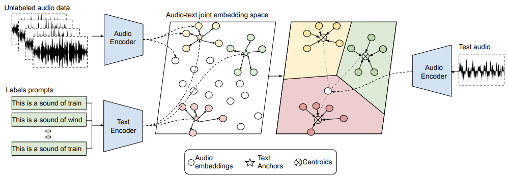
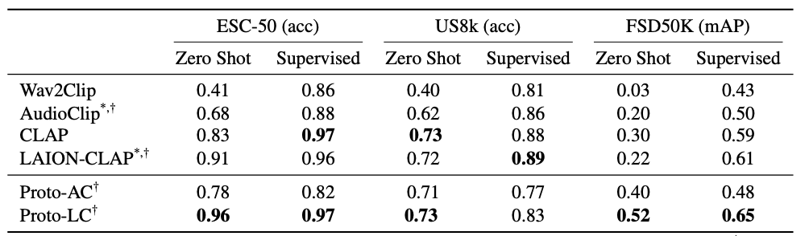

# ZS_audio_text
Official release of the INTERSPEECH-23 paper : [A multimodal prototypical approach for unsupervised sound classification](https://arxiv.org/pdf/2306.12300.pdf)



### Before you start :
### &nbsp; Environment setup
```
#create the conda environment
conda create --name multi_proto python=3.8
conda activate multi_proto

#install required packages 
pip install -r requirements.txt
```
<br>

### Demo code 
Use our pre-computed prototype embeddings to find the class label (in ESC-50) for your input audio 
```
python demo.py --model_type=<proto-ac/proto-lc> --audio_path=<path_to_your_audio_file>
``` 
<br>


Our results in the paper:
\
We noticed small discrepancy in reproducing results for laion-clap, maybe due to recent update in it.

<br>

## Reproducing the results
1. Clone the repo with submodule
2. Download data and put them in the `data/input` directory
3. Download pretrained model for AudioClip and LIAON-CLAP
4. Use the already extracted audio-embeddings (we also provide the scripts to extract embedding i.e. `extract_embed.py`)
5. For `proto-ac` and `proto-lc` models run `prototypical.py` script with the desired model and dataset
6. For audioclip and laion-clap results run `baseline.py` script.

<br>

### 1. Clone the repo
```
git clone --recurse-submodules git@github.com:sakshamsingh1/ZS_audio_text.git
```

### 2. Download the datasets
```
cd data/input

# Download the ESC-50 dataset
git clone git@github.com:karolpiczak/ESC-50.git

# Download the US8K dataset
python download_us8k.py

# Download the FSD50K dataset
python download_fsd50k.py
```

### 3. Download the pretrained models
```
# For AudioCLIP
# should be downloaded in scripts/ref_repo/AudioCLIP/assets
! wget https://github.com/AndreyGuzhov/AudioCLIP/releases/download/v0.1/AudioCLIP-Full-Training.pt
! rm bpe_simple_vocab_16e6.txt.gz
! wget https://github.com/AndreyGuzhov/AudioCLIP/releases/download/v0.1/bpe_simple_vocab_16e6.txt.gz 

#FOR LAION_CLAP
# Should be downloaded in data/input
wget https://huggingface.co/lukewys/laion_clap/resolve/main/630k-audioset-fusion-best.pt 
```

### 4. Extracting embeddings
Download the extracted embeddings here [Google drive](https://drive.google.com/drive/folders/16NHruWbryJdkpRF2jYNopwJiQUg-sgmK?usp=sharing) and put inside `data/processed` \
&nbsp; &nbsp; &nbsp; &nbsp; &nbsp; &nbsp; &nbsp; &nbsp; &nbsp; &nbsp; &nbsp; &nbsp; &nbsp; &nbsp; &nbsp; OR

We also provide code for extracting embeddings but it is slow (and has to be optimized). 

```
python extract_embd.py --model_type <audioclip/clap> --dataset_name <esc50/us8k/fsd50k>
```

### 5. Our prototypical approach (Proto-AC and Proto-LC rows in the result's table)
```
python prototypical.py --model_type <proto-lc/proto-ac> --data <esc50/us8k/fsd50k> --train_type <zs/sv>
```

### 6. Baseline results (AudioClip and LAION-CLAP rows in the result's table)
```
python baseline.py --model_type <audioclip/clap> --data <esc50/us8k/fsd50k> --train_type <zs/sv>
```